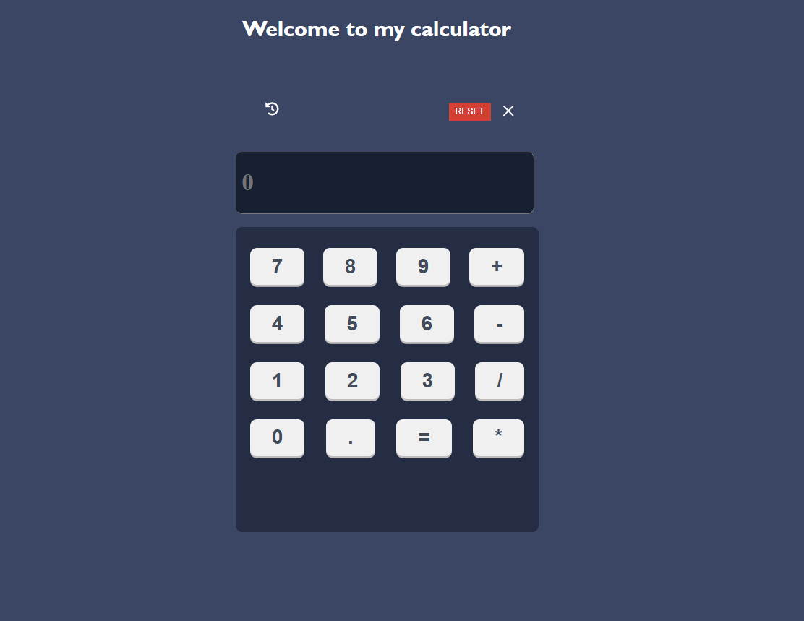

# React Calculator

A simple and responsive calculator built with React.js. This project demonstrates the use of React components, state management, and basic styling techniques.

---

## Features

- Perform basic arithmetic operations (addition, subtraction, multiplication, division).
- Clear input and reset the calculator.
- Responsive and user-friendly design.
- Live calculation updates.

- Real-time Calculation Display: Updates instantly as you type.
- Responsive Design: Works seamlessly across all devices.
- Modular Components: Built with reusable and well-structured React components.
- State Management: Utilizes React hooks for efficient state handling.
- Error Handling: Ensures smooth and bug-free performance.

---

## Preview




---

## Getting Started

Follow these instructions to set up the project locally.

### Prerequisites

Make sure you have the following installed:

- [Node.js](https://nodejs.org/) (v14 or above)
- [npm](https://www.npmjs.com/) or [yarn](https://yarnpkg.com/)

---

### Installation

1. Clone the repository:
   ```bash
   git clone https://github.com/tubakousar/my-calculator.git
